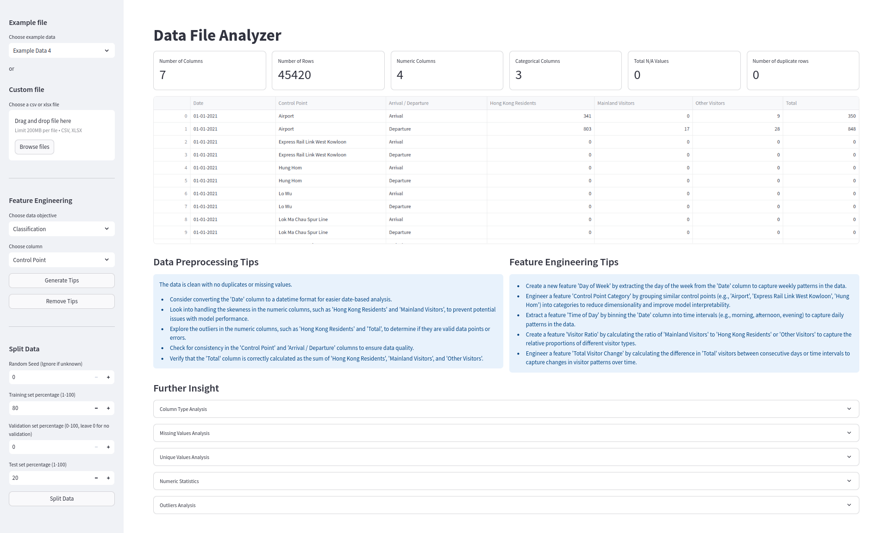

#  AIEDA (Artificial Intelligence Exploratory Data Analysis) tool

🌿 Made by Kinto


## ⚡ Quick introduction

AIEDA is an AI tool designed to assist users, such as data scientists, in analyzing CSV datasets by providing actionable insights. Its primary functionalities include generating preprocessing strategies and feature engineering recommendations tailored to specific analytical goals, such as classification or regression. By intelligently assessing the dataset's structure and content, AIEDA offers essential guidance for optimizing data for effective model training and evaluation. Additionally, it can generate useful plots and graphs to enhance the analytical workflow.

<p align="center">

</p>

With AIEDA, users can streamline the data preparation process, ensuring that their analytical workflows are both efficient and effective.

### Features
- Insight generation on data
- Preprocessing tips
- Feature engineering recommendations based on goals
- Data splitting capabilities


## 🔧 Setup

### TogetherAI API
1. Create a TogetherAI account to access the LLM model.
2. Obtain your API Key.

#### Cost Notice:
At the time at which this is made, the following model is available for free:

- **Meta Llama 3.3 70B Instruct Turbo**

Always check for costs before usage:  [TogetherAI Models Costs](https://api.together.ai/models)
<br>


## 💾 Pip installation

**1) Ensure your system has the following dependency:**

- Python3.12

**2) Clone the repository:**
```bash
git clone https://github.com/MichuPicchu/CleanAI.git
cd CleanAI
```

**3) Install the packages:**
```bash
pip install -r requirements.txt
```

**4) Setup environment variable**
```bash
export TOGETHER_API_KEY="<Insert your API key here>"
```

**5) Run the application**
```bash
streamlit run main.py
```

## 🐳 Docker installation

**1) Git clone the repo:**
```bash
git clone https://github.com/MichuPicchu/CleanAI.git
cd CleanAI
```

**2) Build via docker:**
```
docker build -t aieda .
```

**3) Run container**
```
docker run -p 8501:8501 -e TOGETHER_API_KEY="<Your API Key>" aieda
```

## 📝 Notes
The example data used in this repo were taken from the HK Open data and Kaggle source:
<br>
```
https://data.gov.hk/en-datasets
```
<br>

## 🌟 Support me

[](https://buymeacoffee.com/kinto)
